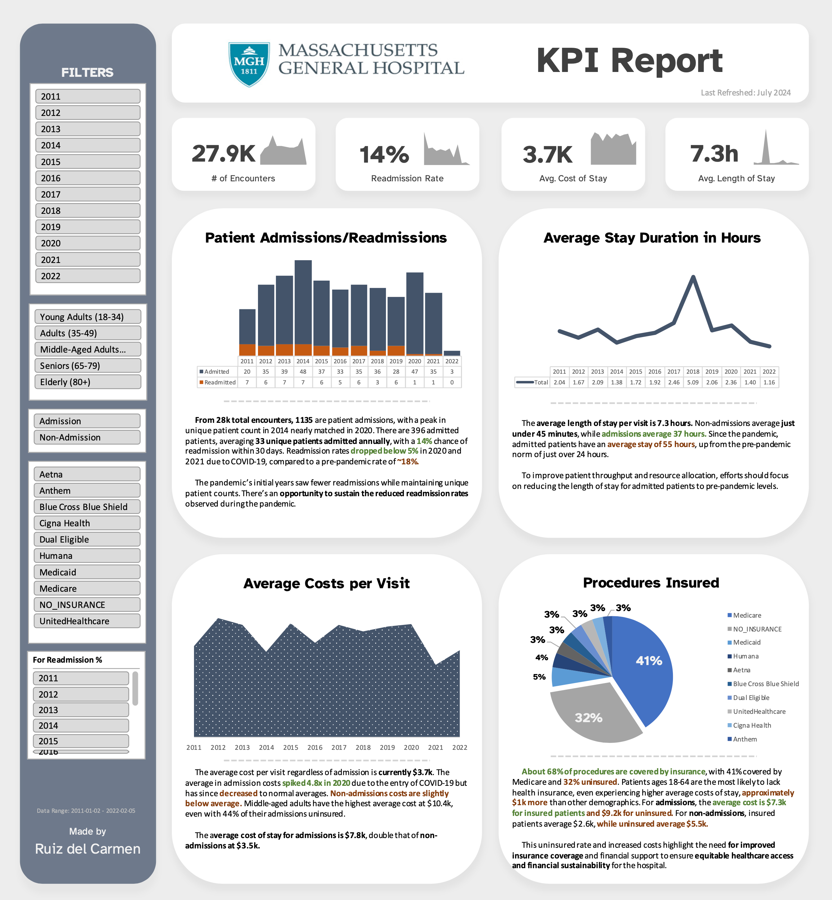

# Massachusetts General Hospital - Tailored KPI Report

## Project Scope

As an Analytics Consultant for Massachusetts General Hospital (MGH), I was tasked with developing a high-level KPI report for the executive team. This report leverages synthetic patient records from 2011-2022, encompassing approximately 1,000 patients’ demographics, insurance coverage, and medical encounters & procedures. My role was to transform this data into actionable insights that reflect the hospital’s performance over the years. For this project, **I challenged myself to do it purely on Excel.**

## KPI Report Overview

This KPI report format aims to give the executive team a **comprehensive yet clear view** of the hospital's operational dynamics, focusing on patient admissions/readmissions, length of stay, and procedural costs. **It features PDF exportability and attribute-specific filtering to enable stakeholders to quickly access and export tailored insights.** The report's concise, one-page format ensures that it remains straightforward and accessible, concentrating on **delivering impactful, easily digestible insights** based on specific, data-driven questions about hospital performance.

In defining hospital admissions and readmissions, I adhered strictly to clinical definitions *(based off of my research and my inquiring of people in the medical field who has better domain knowledge)*, **considering only inpatient encounters as admissions and using a 30-day threshold to classify readmissions**, enhancing the accuracy of our data analysis.

## Surfaced Insights

- **How many patients have been admitted or readmitted over time?**
    - From 28k total encounters, **1135 are patient admissions**.
    - There was a peak in unique patient count in 2014, nearly matched in 2020.
    - There are **396 admitted patients**, averaging 33 unique patients admitted annually.
    - There is a **14% chance of readmission within 30 days**.
    - **Readmission rates dropped below 5% in 2020 and 2021 due to COVID-19**, compared to a pre-pandemic rate of ~18%.
    - The pandemic's initial years saw fewer readmissions while maintaining unique patient counts.
    - There's an opportunity to sustain the **reduced readmission rates observed during the pandemic**.

- **How long are patients staying in the hospital, on average?**
    - The average length of stay per visit is **7.3 hours**.
    - Non-admissions average 6.1 hours, while admissions average **37 hours**.
    - Since the pandemic, admitted patients have an average stay of **55 hours**, up from the pre-pandemic norm of just over 24 hours.
    - Non-admissions have a consistent average stay of just under 45 minutes.
    - Efforts should focus on **reducing the length of stay for admitted patients to pre-pandemic levels** to improve patient throughput and resource allocation.

- **How much is the average cost per visit?**
    - The average cost per visit, regardless of admission, is currently **$3.7k**.
    - The average admission cost spiked 4.8x in 2020 due to the entry of COVID-19 but has since decreased to normal averages.
    - Non-admission costs are slightly below average.
    - Middle-aged adults have the **highest average cost at $10.4k**, even with 44% of their admissions uninsured.
    - The average cost of stay for admissions is **$7.8k**, double that of non-admissions at $3.5k.

- **How many procedures are covered by insurance?**
    - About **68% of procedures are covered by insurance**, with 41% covered by Medicare and 32% uninsured.
    - Patients ages 18-64 are the most likely to lack health insurance, experiencing higher average costs of stay, approximately **$1k more than other demographics**.
    - For admissions, the average cost is $7.3k for insured patients and **$9.2k for uninsured**.
    - For non-admissions, insured patients average $2.6k, while uninsured average $5.5k.
    - This uninsured rate and increased costs highlight the need for **improved insurance coverage and financial support** to ensure equitable healthcare access and financial sustainability for the hospital.

## Key Questions for Stakeholders Prior to Project Advancement

> These are some questions I would've loved to ask stakeholders/project leads to learn more about their own needs/based knowledge on the objective at hand.

- What interval do you use for measuring readmissions: 30, 60, or 90 days after a previous admission?
- Should readmissions be related to the same medical conditions or reasons as the initial admission?
- How are encounter entries recorded? Given that some admissions are logged exactly 24 hours apart, how should these be treated? Are these entries reset daily, or should they be considered continuous admissions?

## Areas for Improvement and Future Developments

- Incorporating more comparative data, such as year-to-date versus the previous year-to-date and quarterly comparisons, would add depth to the analysis. Currently, my skill set limits this aspect. I would love to improve on this once I gain more familiarity with my tools.
- Excel on Mac posed specific challenges, particularly with functions like 'Distinct Count' in pivot tables, which affected the interactivity of the dashboard elements like admissions. Moving to a more robust data visualization tool like Tableau would've streamlined this process.
- Expanding the dashboard with additional tabs/pages—for detailed patient demographics, peak operational hours, and specific admission times—would provide more granular insights. However, personal time constraints limited these enhancements in this current iteration, and the insights I surfaced I deemed were the most important to give stakeholders visibility into the hospital’s recent performance.

## General Info

- For more about my projects and data journey, visit my [Portfolio](https://ruiz.super.site/).